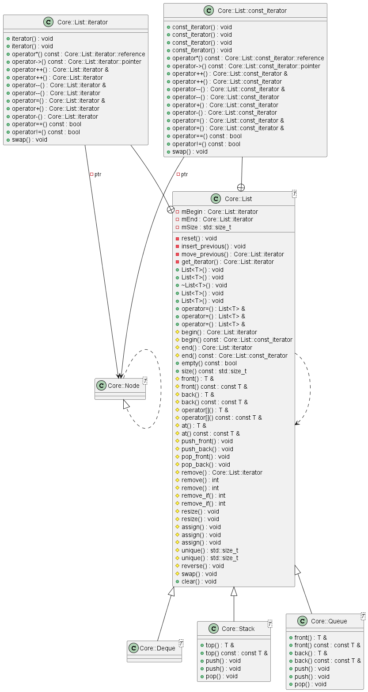
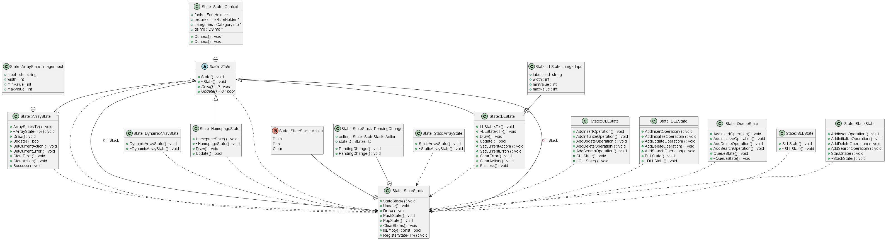
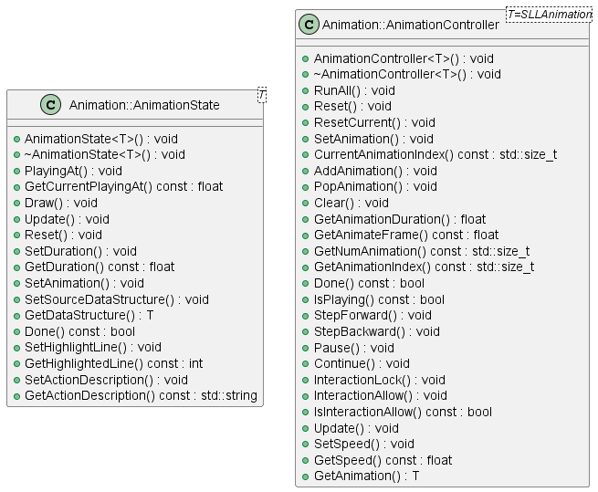
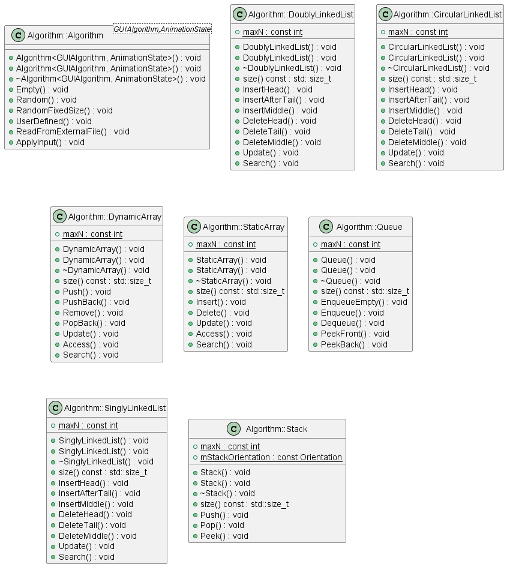
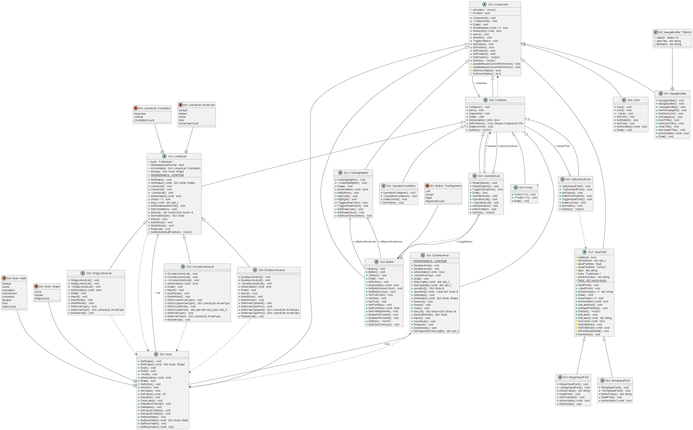

# CS162-VisuAlgo

Repository: https://github.com/ntploc21/CS162-VisuAlgo

APCS - CS162 Solo Project - VisuAlgo

This is a project for the course CS162 - Introduction to Computer Science II. 

In this project, I will do a data visualization application that tries to replicate what [VisuAlgo](https://visualgo.net/en) does. Such application provides an intuitive and user-friendly interface for the display and understanding data stored in basic data structures. Users can choose from a variety of data structures (listed in the Features), and can easily initialize, add, delete, update, and search data within these data structures.
## Features
It currently supports the following data structures:
- Array
- Dynamic Array (similar to `std::vector`)
- Linked List
- Doubly Linked List
- Circular Linked List
- Stack
- Queue

Notable features include:
- Visualization of initialization and CRUD operations of different data structures
- Step-by-step code highlight
- Animation controller (play, pause, stop, etc) so that you can see the visualization in your own pace
- Action description (by natural language) for each step
- Color theme (with light theme and dark theme supported)
- And many more!

## Demo
Will be added soon!

## Repository
[Here is the repository of the project on GitHub.](https://github.com/ntploc21/CS162-VisuAlgo)

## License
This project is licensed under the GNU General Public License v3.0 - see the [LICENSE](LICENSE) file for details.

## Dependencies
### Application
* C++20 (GNU GCC 11.3.0)
* CMake
* [Raylib](https://github.com/raysan5/raylib) and [Raygui](https://github.com/raysan5/raygui)
* [tinyfiledialogs](https://sourceforge.net/projects/tinyfiledialogs/)
### Unit Test
* [doctest](https://github.com/doctest/doctest/tree/master)
### Documentation
* [Doxygen](https://www.doxygen.nl/)
* [Graphviz](https://graphviz.org/)
* [PlantUML](https://plantuml.com/)
* [clang-uml](https://github.com/bkryza/clang-uml)

## Building
### Manual
1. Clone this repository to your machine.
    ```bash
    git clone https://github.com/ntploc21/CS162-VisuAlgo.git
    cd CS162-VisuAlgo
    ```
2. Run the following commands
    ```bash
    cmake -S. -Bbuild
    make -Cbuild // or any other build tool you are using
    ```
3. The executable ```CS162-VisuAlgo``` will appear in the ```build``` folder.

### IDEs (Visual Studio, CLion, etc)
These IDEs usually have a built-in CMake support and will automatically set up the project from the CMake configurations. So you can just open/clone the project from this GitHub repository, configure the project and build it.

### Notes
- If you can't build the project, make sure you have installed all of the dependencies.
- If CMake chooses the wrong build system, you can run ```cmake -G``` and look for the build system you want to use. Then, you can specify the build system by adding ```-G [your build system]``` to the ```cmake``` command. For example, if you want to use Ninja, you can run ```cmake -S. -Bbuild -G Ninja```.

## Project Structure
- [```assets/```](assets): contains the Application assets (e.g fonts, images, etc)
- [```docs/```](docs): Documentation of the project implementation
    - [```diagrams/```](docs/diagrams/): PlantUML scripts and generated diagrams
    - [```images/```](docs/images/): Images for the user manual
    - [```html/```](docs/html/): The deployable HTML version of the documentation
    - [```latex/```](docs/latex/): The LaTeX version of the documentation
- [```unittest/```](unittest): contains unit tests for the implementation of the data structures
- [```src/```](src): ontains source code of the project implemented
    - [```Algorithms/```](src/Algorithms/): generate step-by-step instruction for animating/visualizing the data structures and algorithms
    - [```Animation/```](src/Animation/): processes animation and visualization also animation controller such as play, pause, stop, etc
    - [```Components/```](src/Components): contains UI components that are used in different scenes
        - [```Common/```](src/Components/Common/): contains commonly used UI components (e.g Button, etc)
        - [```Visualization/```](src/Components/Visualization/): contains UI components used mainly for visualization (e.g ```GUI::Node```, ```GUI::SinglyLinkedList```, etc)
    - [```Core/```](src/Core): contains implementation of the data structures
    - [```Identifiers/```](src/Identifiers): contains VisuAlgo identifiers for scene, font, etc
    - [```States/```](src/States): contains the scenes of the application (e.g the main menu, the visualization scene, etc)
    - [```Utils/```](src/Utils): contains utility functions
- [```include/```](include): contains external dependencies (which are not fetched by CMake)

## Documentation
### User Manual
Please refer to the [User Manual](USER_MANUAL.md) for more information about the usage of the application.
### Program structure
For the LaTeX version, please refer to [```docs/latex/refman.pdf```](docs/latex/refman.pdf).

<!-- For the HTML version, please see [this webpage](docs\html\index.html).
-->

## Modeling structure overview
For a more detailed overview, please refer to the [documentation](#documentation-1).

### Examples of design patterns in this project
Will be updated soon!

### UML Diagrams










## Contributor
22125050 - Nguyen Thanh Phuoc Loc

ntploc21@gmail.com

https://www.facebook.com/ntploc.21/
