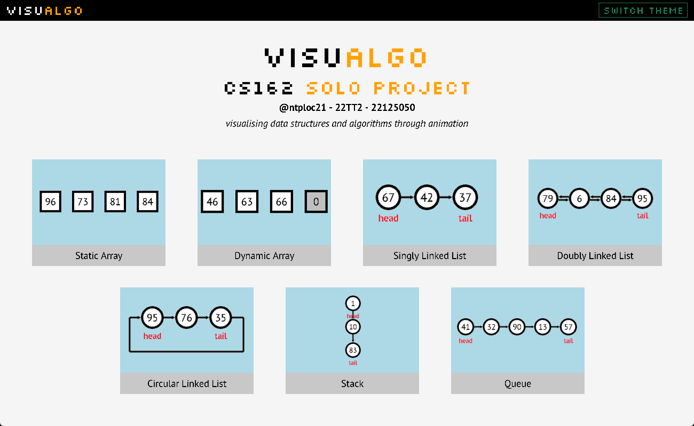
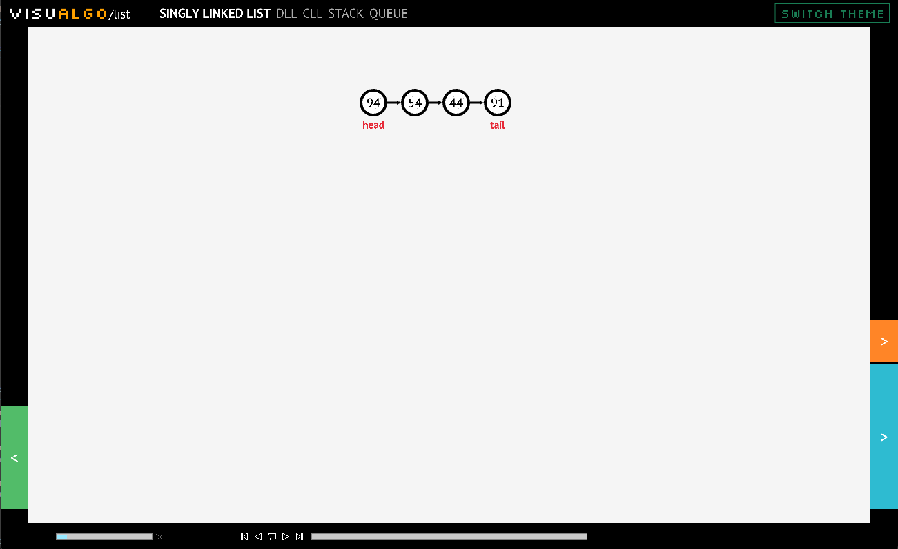
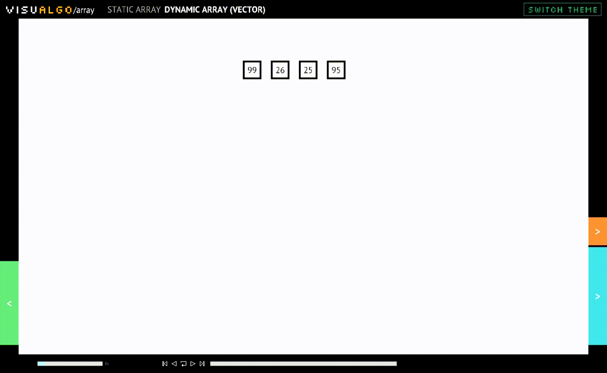
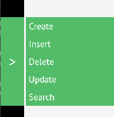
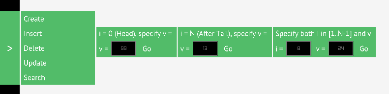
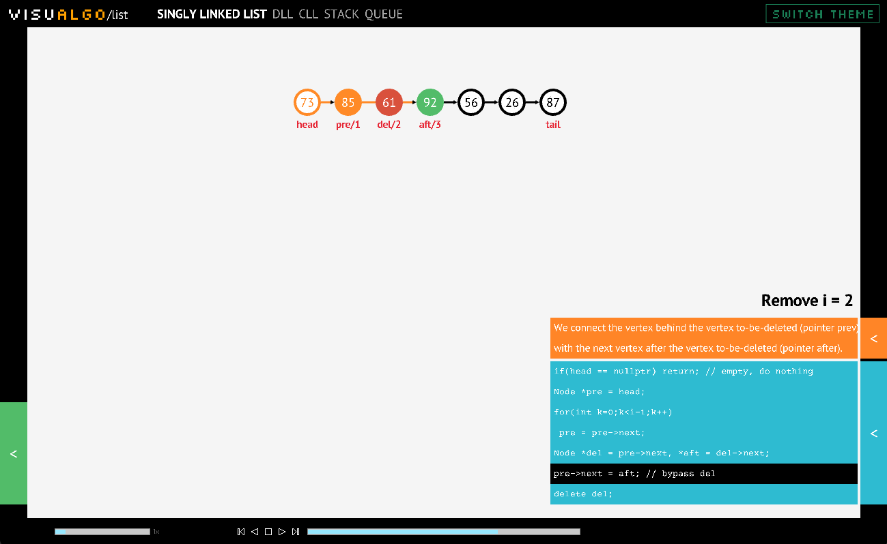
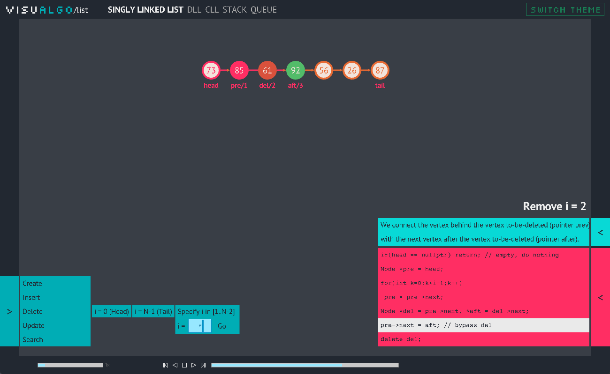
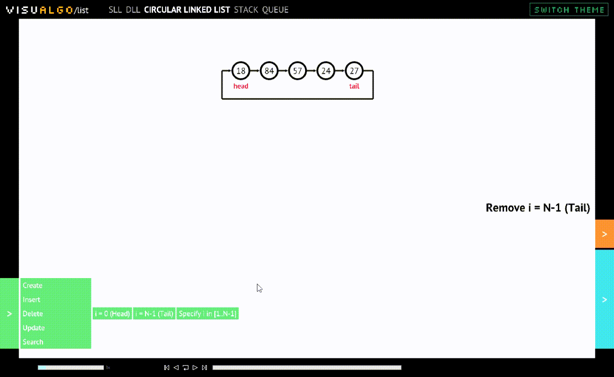

# User Manual

## Homepage/Menu screen

- Start by clicking on any data structure or algorithm you want to visualize listed on the screen.
- switch between light and dark mode by clicking on the ```switch theme``` button on the top right corner of the screen.

## Data Structure/Algorithm screen (Main view)
<!--  -->


- The main view of the application is divided into 5 parts:
    - **Navigation**: the navigation bar on the top of the screen allows you to go back to the homepage (click on the ```VISUALGO``` icon) or move to another data structure/algorithm of the same category (which you can see on top of the image, the 5 data structures are in the ```Linked List``` category)
    - **Visualization**: the visualization of the data structure/algorithm (the main part of the screen)
    - **Action**: the action panel on the left side of the screen provides you a list of actions you can perform on the data structure/algorithm
    - **Code & Description**: the code of the data structure/algorithm and the description of the current step (the right part of the screen)
    - **Controller**: the control panel of the application on the bottom, which allows you to control the visualization (e.g play, pause, stop, etc)

## Action panel

- The action panel is located on the left side of the screen. It provides you a list of actions you can perform on the data structure/algorithm. (e.g create/initialize a new data structure, insert a new node, delete a node, etc)

- Clicking on an action will show a list of specific actions you can perform. (e.g insert a new node at the beginning, insert a new node at the end, etc)

## Animation controller

- The animation controller is located at the bottom of the screen. It allows you to control the visualization of the data structure/algorithm.
    - Adjust the speed of the animation by dragging the slider on the left side of the controller.
    - Play, pause, replay the animation by clicking on the corresponding buttons. Also, you can move to the previous or to the next step by clicking on the second button from the left or the second button from the right respectively. (```<|``` and ```|>```)
    - Finally, you can move between steps by dragging the slider on the right side of the controller.

## When an action is requested to run


- When an action is running, you can see the animation running right on the main view. The ```Action``` panel will be disabled and the ```Code & Description``` panel will automatically toggle on to show the code and description of the current step. You can also see the current step highlighted in the code.

## Switching between themes



You can switch between light and dark mode by clicking on the ```switch theme``` button on the top right corner of the screen.

## Some nice gifs of the animation


<!--  -->